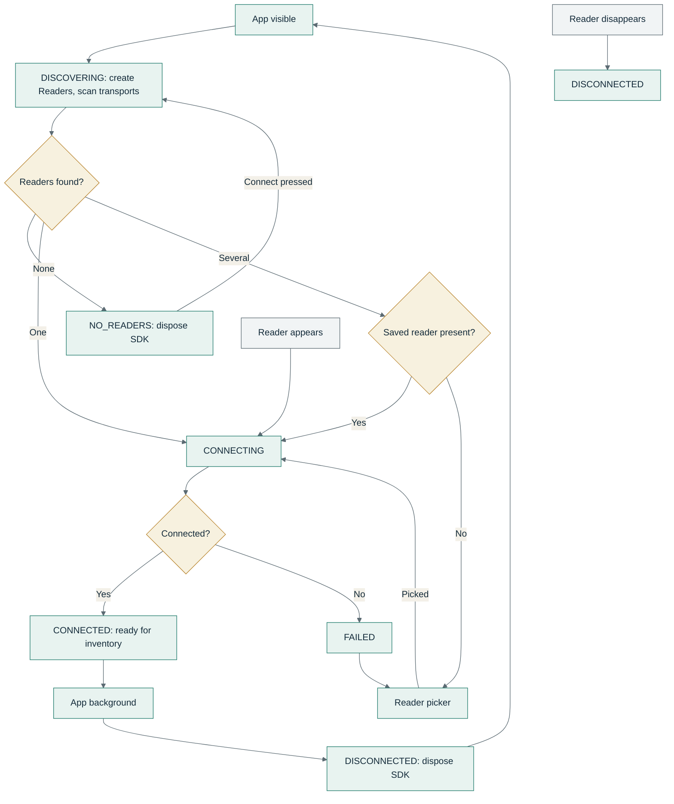
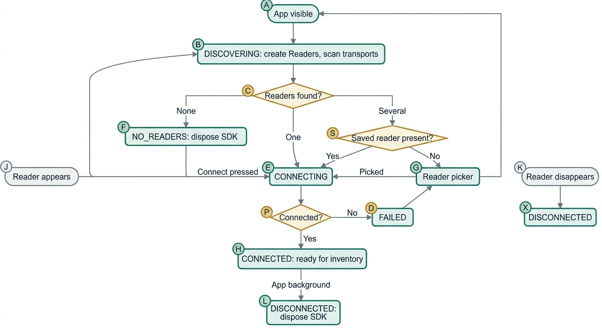
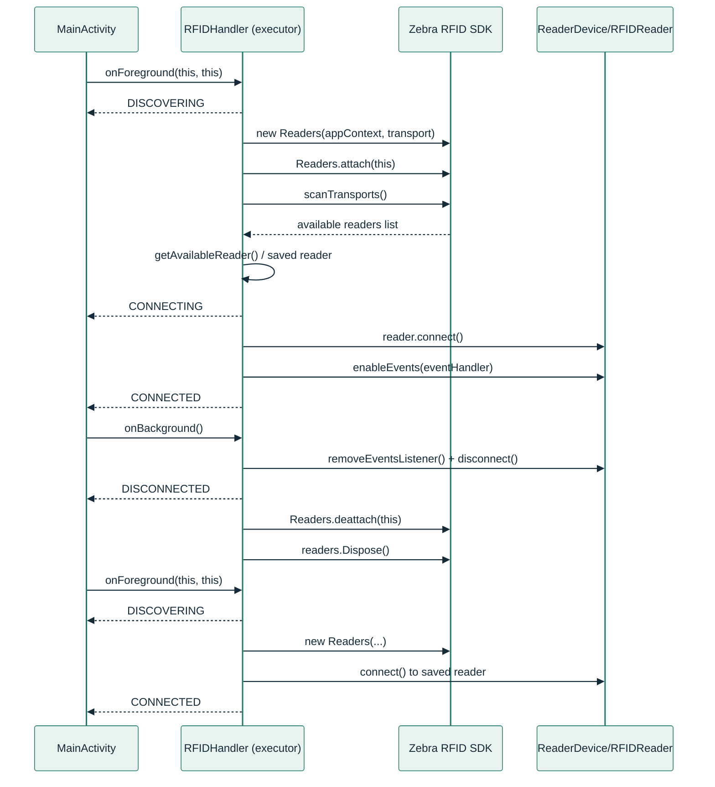
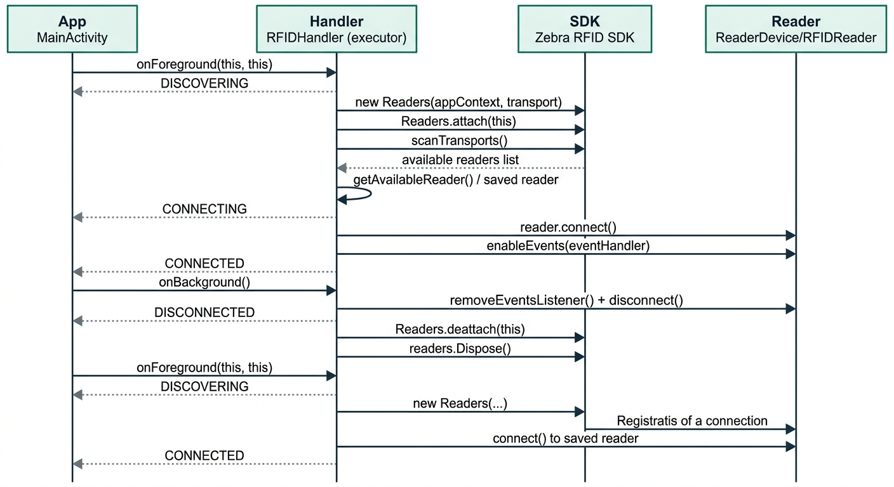
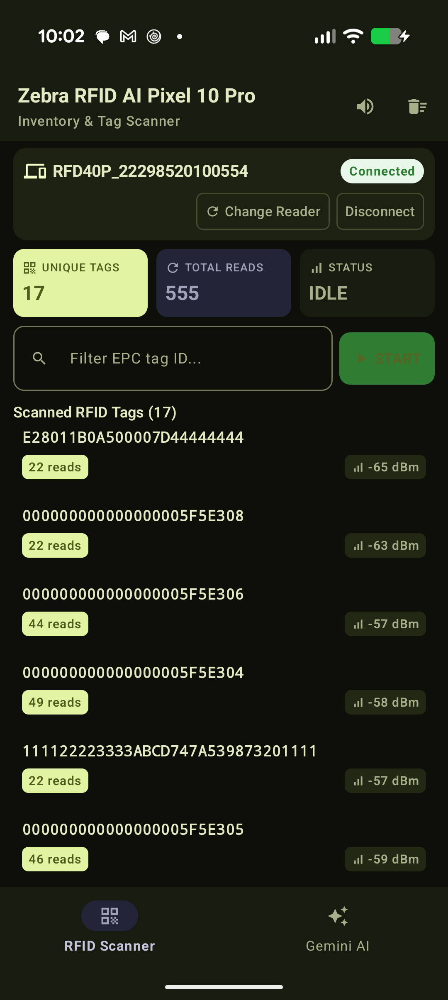
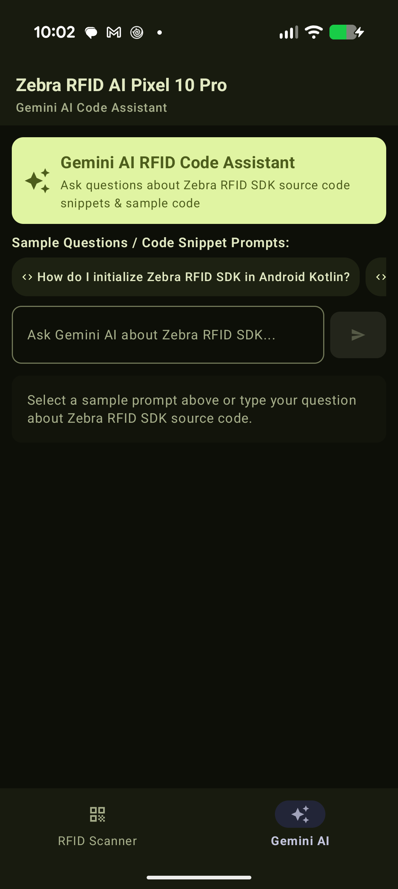
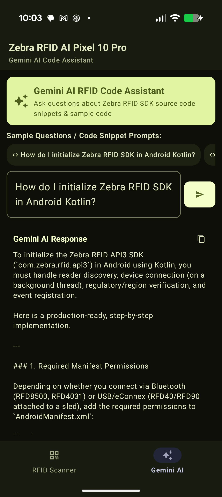

# Zebra RFID AI - Technical Design Document & Architecture

This document outlines the architecture, connection flows, activity lifecycle support (suspend & resume), inventory operations, and **Gemini 3.8 AI** assistant integration for the **Zebra RFID AI** Android application.

---

## 1. System Architecture & Connection State Flow

All Zebra RFID SDK operations are serialized on a single-threaded background executor (`ExecutorService`) in `RfidHandler.kt` to guarantee thread safety and maintain a smooth **60fps Jetpack Compose UI**.




---

## 2. Sequence Diagram: Connection & Lifecycle Flow




---

## 3. UI Screenshots & Visual Interface

- **RFID Inventory Scanner:** real-time connection status, unique tag counts, total reads, EPC filter search bar, and inventory start/stop controls.
- **Gemini AI Assistant:** preset prompt chips for Zebra RFID SDK code snippets and inventory analysis.
- **Gemini AI Code Response:** Gemini 3.8 AI generated code explanation with local caching (`⚡ Cached`) and force-refresh support.





---

## 4. Code Implementation Highlights

### A. RFID Initialization, Discovery & Region Setup (`RfidUtility.kt`)
```kotlin
object RfidUtility {
    const val DEFAULT_READER_NAME = "RFID-TC701"

    @Throws(InvalidUsageException::class)
    fun scanTransports(readers: Readers): ArrayList<ReaderDevice> {
        for (candidate in ENUM_TRANSPORT.values()) {
            if (candidate == ENUM_TRANSPORT.ALL) continue
            try {
                readers.setTransport(candidate)
                val found = readers.GetAvailableRFIDReaderList()
                if (found != null && found.isNotEmpty()) return found
            } catch (_: InvalidUsageException) {}
        }
        return ArrayList()
    }

    fun configureRegion(reader: RFIDReader, regionCode: String = "USA"): String? {
        try {
            val regCfg = reader.Config.regulatoryConfig
            val supportedRegions = reader.ReaderCapabilities.SupportedRegions
            for (i in 0 until supportedRegions.length()) {
                val regionInfo = supportedRegions.getRegionInfo(i)
                if (regionCode.equals(regionInfo.regionCode, ignoreCase = true)) {
                    regCfg.region = regionInfo.regionCode
                    regCfg.setIsHoppingOn(regionInfo.isHoppingConfigurable)
                    regCfg.setEnabledChannels(regionInfo.supportedChannels)
                    regCfg.setStandardName(regionInfo.name)
                    reader.Config.regulatoryConfig = regCfg
                    return null
                }
            }
            return "Region $regionCode not supported"
        } catch (e: Exception) {
            return e.message
        }
    }
}
```

### B. Gemini 3.8 AI Assistant with Local Caching (`RfidAiViewModel.kt`)
```kotlin
class RfidAiViewModel(application: Application) : AndroidViewModel(application) {
    private val generativeModel = Firebase.ai.generativeModel("gemini-3.8-flash")
    private val sharedPreferences = application.getSharedPreferences("gemini_cache", Context.MODE_PRIVATE)
    private val responseCache = ConcurrentHashMap<String, String>()

    fun askQuestion(userPrompt: String, scannedTags: List<TagItem> = emptyList(), forceRefresh: Boolean = false) {
        val cacheKey = userPrompt.trim().lowercase()
        if (!forceRefresh && responseCache.containsKey(cacheKey)) {
            _uiState.value = RfidAiUiState.Success(responseCache[cacheKey]!!, isCached = true)
            return
        }
        viewModelScope.launch(Dispatchers.IO) {
            val response = generativeModel.generateContent(content { text(userPrompt) })
            response.text?.let { output ->
                responseCache[cacheKey] = output
                sharedPreferences.edit().putString(cacheKey, output).apply()
                _uiState.value = RfidAiUiState.Success(output, isCached = false)
            }
        }
    }
}
```
