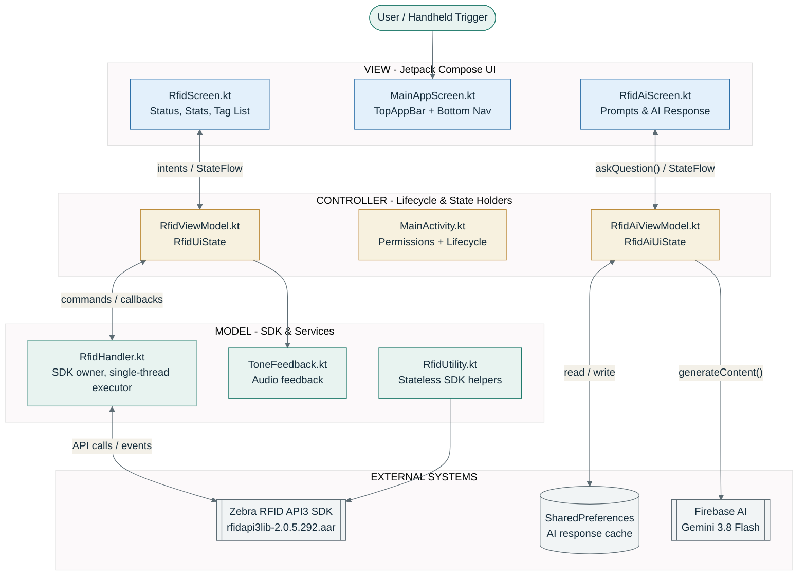
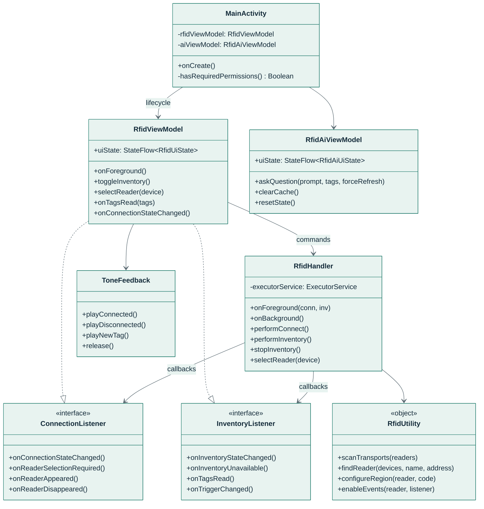
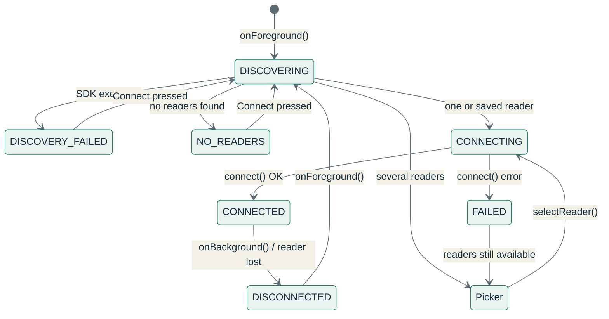
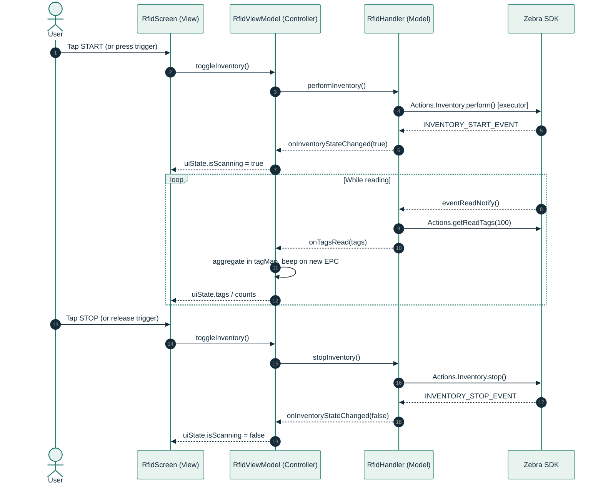
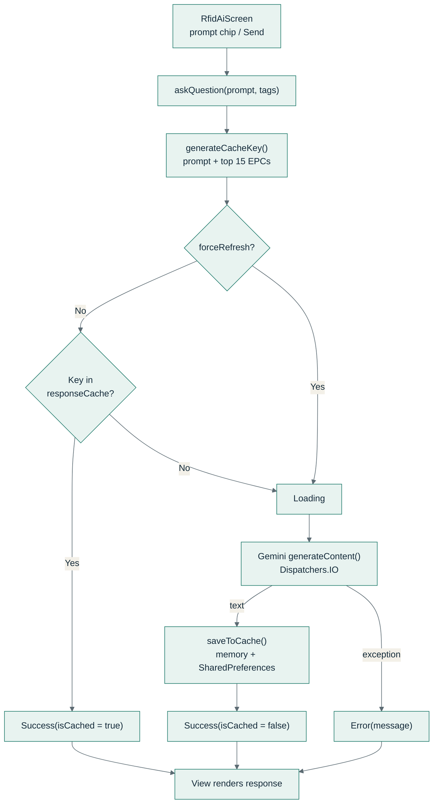
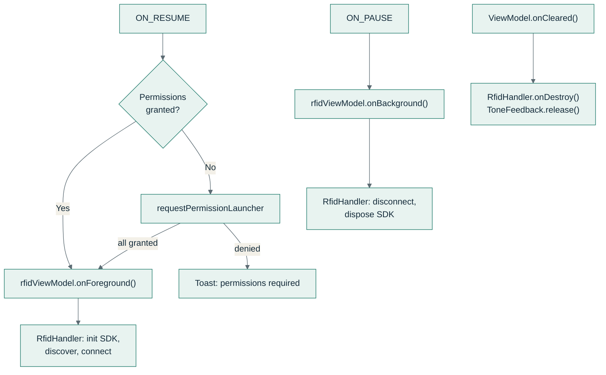

# Zebra RFID AI - MVC Architecture & Source Code Guide

This guide maps every source file of the **Zebra RFID AI** Android application to the **Model-View-Controller (MVC)** pattern, shows how data and events flow between the layers, and walks through the core methods needed to implement the project with code taken directly from the source tree.

> **MVC on modern Android.** Jetpack Compose apps implement MVC in its *MVVM* form: the **ViewModel** plays the Controller role (it receives user intents and drives the Model), and it exposes an observable `StateFlow` that the View renders. `MainActivity` is the platform-level Controller that owns lifecycle and permissions. The separation of concerns is the same as classic MVC: the View never touches the SDK, and the Model never touches the UI.

---

## 1. Architecture at a Glance



**Reading the diagram**

- Each two-way link is labelled **command / state**: the first word travels down (user intent → Controller → Model → SDK), the second travels up (SDK events → Model listeners → Controller `StateFlow` → View recomposition).
- `MainAppScreen` hosts both screens; `MainActivity` hosts `MainAppScreen` and forwards `onForeground()` / `onBackground()` to `RfidViewModel`; `RfidHandler` calls the SDK through `RfidUtility`.
- The View only knows about ViewModels; the Model only knows about listener interfaces. Neither side depends on the other directly.

---

## 2. Source File to MVC Role Map

| Layer | File | Responsibility |
| :--- | :--- | :--- |
| **View** | `MainAppScreen.kt` | App shell: `Scaffold`, `TopAppBar` actions (sound, clear), bottom `NavigationBar` switching Scanner / Gemini AI tabs. |
| **View** | `RfidScreen.kt` | Connection status card, stats row, EPC search, START/STOP button, `LazyColumn` of `TagCard`, reader-selection dialog. |
| **View** | `RfidAiScreen.kt` | Preset prompt chips, prompt input, AI response card with cache badge, copy and force-refresh. |
| **View** | `ui/theme/*.kt` | Material 3 colors, typography, and `AIRFIDTheme`. |
| **Controller** | `MainActivity.kt` | Entry point. Requests Bluetooth/Location permissions and maps `ON_RESUME` / `ON_PAUSE` to `onForeground()` / `onBackground()`. |
| **Controller** | `RfidViewModel.kt` | Translates UI intents into `RfidHandler` commands; implements `ConnectionListener` + `InventoryListener`; aggregates tags; publishes `RfidUiState`. |
| **Controller** | `RfidAiViewModel.kt` | Builds the Gemini prompt (with scanned-tag context), manages the two-level cache, publishes `RfidAiUiState`. |
| **Model** | `RfidHandler.kt` | Owns the Zebra SDK: discovery, connect, region retry, events, inventory, disconnect and dispose. All SDK calls run on one background thread. |
| **Model** | `RfidUtility.kt` | Stateless SDK helpers: transport scan, reader matching, region configuration, event registration, display names. |
| **Model** | `ToneFeedback.kt` | `ToneGenerator` beeps for connect, disconnect, and new-tag events. |
| **Model** | `TagItem`, `RfidUiState`, `RfidAiUiState` | Immutable data classes that describe a tag and each screen's state. |

### Layer rules enforced in the code

1. **View → Controller only.** Composables receive a ViewModel and call its public methods; they never import `com.zebra.rfid.api3` action APIs.
2. **Commands down, callbacks up.** The Controller drives the Model with commands; `RfidHandler` reports back through `ConnectionListener` and `InventoryListener`, so it has no dependency on Android UI classes.
3. **Single source of truth.** Each screen renders one immutable `UiState` object held in a `MutableStateFlow`; every change goes through `_uiState.update { it.copy(...) }`.
4. **Threading boundary.** SDK work runs on `RfidHandler`'s single-thread executor; UI state is published on `Dispatchers.Main`; Gemini calls run on `Dispatchers.IO`.

---

## 3. Class Relationships



---

## 4. Runtime Flows

### 4.1 Connection State Machine (Model)

`RfidHandler.ConnectionState` is the single enum that drives the status badge in the View.



### 4.2 Inventory Scan: Intent Down, State Up



### 4.3 Gemini AI Question with Cache



### 4.4 Activity Lifecycle (Controller)



---

## 5. Core Methods to Implement the Project

The snippets below come from the source tree, lightly abridged (logging and styling removed), and are ordered in the sequence you would build them: Model first, then Controller, then View.

### 5.1 Model - Serialize All SDK Work (`RfidHandler.kt`)

The Zebra SDK is not thread-safe and several calls block. Every SDK operation is posted to one background thread, so calls never overlap and the UI thread never blocks.

```kotlin
private val executorService: ExecutorService = Executors.newSingleThreadExecutor()

private fun executeOnExecutor(runnable: Runnable) {
    try {
        executorService.execute(runnable)
    } catch (e: RejectedExecutionException) {
        Log.e(TAG, "Task execution rejected", e)
    }
}

fun performInventory() { executeOnExecutor { runInventory(true) } }
fun stopInventory()    { executeOnExecutor { runInventory(false) } }
```

### 5.2 Model - Foreground / Background Entry Points (`RfidHandler.kt`)

The Controller attaches its listeners on foreground and releases the SDK on background.

```kotlin
fun onForeground(connectionListener: ConnectionListener, inventoryListener: InventoryListener) {
    this.connectionListener = connectionListener
    this.inventoryListener = inventoryListener
    active = true
    executeOnExecutor { initOrConnect() }
}

fun onBackground() {
    active = false
    executeOnExecutor { dispose() }
}

private fun dispose() {
    try {
        handleDisconnect()   // remove event listener + reader.disconnect()
        releaseReaders()     // Readers.deattach(this) + readers.Dispose()
        reader = null
        readerDevice = null
    } catch (e: Exception) {
        Log.e(TAG, "Exception in dispose", e)
    }
}
```

### 5.3 Model - Discovery (`RfidHandler.createInstance`)

Creates the `Readers` object, registers for appear/disappear callbacks, scans every transport, then decides the next state.

```kotlin
private fun createInstance() {
    var discovered = ArrayList<ReaderDevice>()
    var error: String? = null
    try {
        val r = Readers(appContext, RfidUtility.firstTransport())
        readers = r
        Readers.attach(this)
        discovered = RfidUtility.scanTransports(r)
    } catch (e: InvalidUsageException) {
        error = e.info
    } catch (e: Exception) {
        error = "SDK Error: ${e.message}"
    }

    availableRFIDReaderList = discovered
    if (!active) return

    if (error != null) {
        releaseReaders()
        notifyState(ConnectionState.DISCOVERY_FAILED, error)
    } else if (discovered.isEmpty()) {
        releaseReaders()
        notifyState(ConnectionState.NO_READERS, null)
    } else if (discovered.size == 1 ||
        RfidUtility.findReader(discovered, preferredReaderName, preferredReaderAddress) != null) {
        connectionTask()
    } else {
        requestReaderSelection()
    }
}
```

### 5.4 Model - Connect with Region Retry (`RfidHandler.connectionTask`)

If the reader reports that no region is configured, the handler sets the region and retries once, then turns on reader events.

```kotlin
val currentReader = reader
if (currentReader != null) {
    notifyState(ConnectionState.CONNECTING, null)
    error = handleConnect()
    if (error != null && error.contains("RFID_READER_REGION_NOT_CONFIGURED")) {
        error = RfidUtility.configureRegion(currentReader, REGION_CODE)
        if (error == null) {
            error = handleConnect()
        }
    }
    if (error == null) {
        configureReader()                       // RfidUtility.enableEvents(reader, eventHandler)
        notifyState(ConnectionState.CONNECTED, null)
        return
    }
}
refreshAvailableReaders()
notifyState(ConnectionState.FAILED, error)
```

### 5.5 Model - SDK Helpers (`RfidUtility.kt`)

Stateless functions keep SDK specifics out of the handler.

```kotlin
/** Leaves `readers` on the first transport that reports readers. */
fun scanTransports(readers: Readers): ArrayList<ReaderDevice> {
    var lastException: InvalidUsageException? = null
    for (candidate in ENUM_TRANSPORT.values()) {
        if (candidate == ENUM_TRANSPORT.ALL) continue
        try {
            readers.setTransport(candidate)
            val found = readers.GetAvailableRFIDReaderList()
            if (found != null && found.isNotEmpty()) return found
        } catch (e: InvalidUsageException) {
            lastException = e
        }
    }
    if (lastException != null) throw lastException
    return ArrayList()
}

fun enableEvents(reader: RFIDReader, listener: RfidEventsListener) {
    reader.Events.addEventsListener(listener)
    reader.Events.setHandheldEvent(true)
    reader.Events.setTagReadEvent(true)
    reader.Events.setAttachTagDataWithReadEvent(false)
    reader.Events.setInventoryStartEvent(true)
    reader.Events.setInventoryStopEvent(true)
}
```

### 5.6 Model - SDK Event Handler (`RfidHandler.EventHandler`)

Converts SDK callbacks into listener calls. Tag reads are fetched on the executor; the handheld trigger starts and stops inventory.

```kotlin
inner class EventHandler : RfidEventsListener {
    override fun eventReadNotify(e: RfidReadEvents?) {
        executeOnExecutor {
            val r = reader ?: return@executeOnExecutor
            val myTags = r.Actions.getReadTags(100)
            if (myTags != null && myTags.isNotEmpty()) {
                inventoryListener?.onTagsRead(myTags)
            }
        }
    }

    override fun eventStatusNotify(rfidStatusEvents: RfidStatusEvents?) {
        if (rfidStatusEvents == null) return
        val data = rfidStatusEvents.StatusEventData
        when (data.statusEventType) {
            STATUS_EVENT_TYPE.HANDHELD_TRIGGER_EVENT -> {
                val trigger = data.HandheldTriggerEventData.handheldEvent
                if (trigger == HANDHELD_TRIGGER_EVENT_TYPE.HANDHELD_TRIGGER_PRESSED && !isReading()) {
                    inventoryListener?.onTriggerChanged(true)
                    performInventory()
                } else if (trigger == HANDHELD_TRIGGER_EVENT_TYPE.HANDHELD_TRIGGER_RELEASED) {
                    inventoryListener?.onTriggerChanged(false)
                    stopInventory()
                }
            }
            STATUS_EVENT_TYPE.DISCONNECTION_EVENT -> executeOnExecutor { handleDisconnect() }
            STATUS_EVENT_TYPE.INVENTORY_START_EVENT -> {
                reading = true
                inventoryListener?.onInventoryStateChanged(true)
            }
            STATUS_EVENT_TYPE.INVENTORY_STOP_EVENT -> {
                reading = false
                inventoryListener?.onInventoryStateChanged(false)
            }
            else -> {}
        }
    }
}
```

> The source uses an `if / else if` chain on `rfidStatusEvents.StatusEventData`; it is shown here as `when` with a local `data` alias for readability. The behavior is identical.

### 5.7 Controller - Lifecycle and Permissions (`MainActivity.kt`)

The Activity is kept thin: it only checks permissions and forwards lifecycle events to the ViewModel.

```kotlin
private val requiredPermissions = arrayOf(
    Manifest.permission.BLUETOOTH_SCAN,
    Manifest.permission.BLUETOOTH_CONNECT,
    Manifest.permission.ACCESS_FINE_LOCATION
)

override fun onCreate(savedInstanceState: Bundle?) {
    super.onCreate(savedInstanceState)
    lifecycle.addObserver(LifecycleEventObserver { _, event ->
        when (event) {
            Lifecycle.Event.ON_RESUME ->
                if (hasRequiredPermissions()) rfidViewModel.onForeground()
                else requestPermissionLauncher.launch(requiredPermissions)
            Lifecycle.Event.ON_PAUSE -> rfidViewModel.onBackground()
            else -> {}
        }
    })
    setContent {
        AIRFIDTheme {
            MainAppScreen(rfidViewModel = rfidViewModel, aiViewModel = aiViewModel)
        }
    }
}
```

### 5.8 Controller - Single UI State (`RfidViewModel.kt`)

One immutable data class describes everything the scanner screen shows.

```kotlin
data class TagItem(
    val epc: String,
    val count: Int,
    val rssi: String,
    val lastSeenMs: Long = System.currentTimeMillis()
)

data class RfidUiState(
    val connectionState: RfidHandler.ConnectionState = RfidHandler.ConnectionState.DISCONNECTED,
    val readerName: String = RfidUtility.DEFAULT_READER_NAME,
    val statusDetail: String? = null,
    val isScanning: Boolean = false,
    val uniqueTagCount: Int = 0,
    val totalReadCount: Int = 0,
    val tags: List<TagItem> = emptyList(),
    val searchQuery: String = "",
    val soundEnabled: Boolean = true,
    val availableReaders: List<ReaderDevice> = emptyList(),
    val showReaderSelectionDialog: Boolean = false,
    val selectionListener: RfidHandler.ReaderSelectionListener? = null
)

private val _uiState = MutableStateFlow(RfidUiState())
val uiState: StateFlow<RfidUiState> = _uiState.asStateFlow()
```

### 5.9 Controller - User Intents to Model Commands (`RfidViewModel.kt`)

```kotlin
fun onForeground() { rfidHandler.onForeground(this, this) }
fun onBackground() { rfidHandler.onBackground() }

fun toggleInventory() {
    if (_uiState.value.isScanning) stopInventory() else startInventory()
}

fun updateSearchQuery(query: String) {
    _uiState.update { it.copy(searchQuery = query) }
    updateTagList()
}

override fun onCleared() {
    super.onCleared()
    rfidHandler.onDestroy()
    toneFeedback.release()
}
```

### 5.10 Controller - Model Callbacks to UI State (`RfidViewModel.kt`)

Listener callbacks arrive on the SDK thread, so state updates are posted to `Dispatchers.Main`. Tag reads are aggregated by EPC in a `ConcurrentHashMap`.

```kotlin
override fun onConnectionStateChanged(state: RfidHandler.ConnectionState, readerName: String, detail: String?) {
    viewModelScope.launch(Dispatchers.Main) {
        val previousState = _uiState.value.connectionState
        _uiState.update {
            it.copy(
                connectionState = state,
                readerName = readerName,
                statusDetail = detail,
                isScanning = if (state != RfidHandler.ConnectionState.CONNECTED) false else it.isScanning
            )
        }
        if (_uiState.value.soundEnabled) {
            if (state == RfidHandler.ConnectionState.CONNECTED && previousState != RfidHandler.ConnectionState.CONNECTED) {
                toneFeedback.playConnected()
            } else if (previousState == RfidHandler.ConnectionState.CONNECTED && state != RfidHandler.ConnectionState.CONNECTED) {
                toneFeedback.playDisconnected()
            }
        }
    }
}

override fun onTagsRead(tagDataList: Array<TagData>) {
    var hasNewTag = false
    for (tag in tagDataList) {
        val epc = tag.tagID ?: continue
        val rssi = tag.peakRSSI.toString()
        totalReads++
        val existing = tagMap[epc]
        if (existing != null) {
            tagMap[epc] = existing.copy(count = existing.count + 1, rssi = rssi,
                lastSeenMs = System.currentTimeMillis())
        } else {
            tagMap[epc] = TagItem(epc = epc, count = 1, rssi = rssi)
            hasNewTag = true
        }
    }
    if (hasNewTag && _uiState.value.soundEnabled) toneFeedback.playNewTag()
    updateTagList()
}

private fun updateTagList() {
    val query = _uiState.value.searchQuery.trim().lowercase()
    val allTags = tagMap.values.sortedByDescending { it.lastSeenMs }
    val filteredTags = if (query.isEmpty()) allTags else allTags.filter { it.epc.lowercase().contains(query) }
    viewModelScope.launch(Dispatchers.Main) {
        _uiState.update {
            it.copy(tags = filteredTags, uniqueTagCount = tagMap.size, totalReadCount = totalReads)
        }
    }
}
```

### 5.11 Controller - Gemini AI with Two-Level Cache (`RfidAiViewModel.kt`)

```kotlin
sealed interface RfidAiUiState {
    data object Initial : RfidAiUiState
    data object Loading : RfidAiUiState
    data class Success(val responseText: String, val isCached: Boolean = false) : RfidAiUiState
    data class Error(val errorMessage: String) : RfidAiUiState
}

private val generativeModel = Firebase.ai.generativeModel("gemini-3.8-flash")
private val responseCache = ConcurrentHashMap<String, String>()   // memory; mirrored in SharedPreferences

fun askQuestion(userPrompt: String, scannedTags: List<TagItem> = emptyList(), forceRefresh: Boolean = false) {
    if (userPrompt.isBlank()) return
    val cacheKey = generateCacheKey(userPrompt, scannedTags)

    if (!forceRefresh) {
        val cachedResponse = responseCache[cacheKey]
        if (!cachedResponse.isNullOrBlank()) {
            _uiState.value = RfidAiUiState.Success(cachedResponse, isCached = true)
            return
        }
    }

    _uiState.value = RfidAiUiState.Loading
    viewModelScope.launch(Dispatchers.IO) {
        val systemInstruction = buildString {
            append("You are an expert Zebra RFID Android SDK AI developer assistant. ")
            // ... device model, SDK topics, and up to 15 scanned tags (EPC, reads, RSSI)
            append("\nUser Question: ")
            append(userPrompt)
        }
        try {
            val output = generativeModel.generateContent(content { text(systemInstruction) }).text
            if (!output.isNullOrBlank()) {
                saveToCache(cacheKey, output)
                _uiState.value = RfidAiUiState.Success(output, isCached = false)
            } else {
                _uiState.value = RfidAiUiState.Error("No response received from Gemini AI.")
            }
        } catch (e: Exception) {
            _uiState.value = RfidAiUiState.Error(e.localizedMessage ?: "Failed to generate AI response.")
        }
    }
}

private fun generateCacheKey(userPrompt: String, scannedTags: List<TagItem>): String {
    val cleanPrompt = userPrompt.trim().lowercase()
    return if (scannedTags.isEmpty()) cleanPrompt
    else "$cleanPrompt|tags:" + scannedTags.take(15).joinToString(";") { "${it.epc}:${it.count}" }
}
```

### 5.12 View - Render State, Emit Intents (`RfidScreen.kt`)

The Composable collects the `StateFlow` and passes lambdas that call ViewModel methods. It holds no business logic.

```kotlin
@Composable
fun RfidScreen(viewModel: RfidViewModel) {
    val uiState by viewModel.uiState.collectAsState()

    Column(modifier = Modifier.fillMaxSize().padding(horizontal = 12.dp, vertical = 6.dp)) {
        ConnectionStatusCard(
            uiState = uiState,
            onConnectClick = { viewModel.performConnect() },
            onDisconnectClick = { viewModel.performDisconnect() },
            onSelectReaderClick = { viewModel.openReaderSelection() }
        )
        StatsSummaryRow(uiState.uniqueTagCount, uiState.totalReadCount, uiState.isScanning)

        OutlinedTextField(
            value = uiState.searchQuery,
            onValueChange = { viewModel.updateSearchQuery(it) },
            placeholder = { Text("Filter EPC tag ID...") }
        )
        Button(onClick = { viewModel.toggleInventory() }) {
            Text(if (uiState.isScanning) "STOP" else "START")
        }

        LazyColumn(verticalArrangement = Arrangement.spacedBy(6.dp)) {
            items(items = uiState.tags, key = { it.epc }) { tagItem -> TagCard(tagItem = tagItem) }
        }
    }

    if (uiState.showReaderSelectionDialog) {
        ReaderSelectionDialog(
            readers = uiState.availableReaders,
            onReaderSelected = { device -> viewModel.selectReader(device) },
            onDismiss = { viewModel.dismissReaderSelectionDialog() }
        )
    }
}
```

> Shortened from the source: styling modifiers, icons, and the empty-state view are omitted.

### 5.13 View - App Shell and Navigation (`MainAppScreen.kt`)

```kotlin
@Composable
fun MainAppScreen(rfidViewModel: RfidViewModel, aiViewModel: RfidAiViewModel) {
    var selectedTab by rememberSaveable { mutableIntStateOf(0) }
    val rfidUiState by rfidViewModel.uiState.collectAsState()

    Scaffold(
        topBar = { /* title + sound / clear actions -> rfidViewModel.toggleSound(), clearTags() */ },
        bottomBar = {
            NavigationBar {
                NavigationBarItem(selected = selectedTab == 0, onClick = { selectedTab = 0 },
                    icon = { Icon(Icons.Default.QrCode, null) }, label = { Text("RFID Scanner") })
                NavigationBarItem(selected = selectedTab == 1, onClick = { selectedTab = 1 },
                    icon = { Icon(Icons.Default.AutoAwesome, null) }, label = { Text("Gemini AI") })
            }
        }
    ) { innerPadding ->
        Box(Modifier.fillMaxSize().padding(innerPadding)) {
            when (selectedTab) {
                0 -> RfidScreen(viewModel = rfidViewModel)
                1 -> RfidAiScreen(aiViewModel = aiViewModel, rfidViewModel = rfidViewModel)
            }
        }
    }
}
```

> Shortened from the source: `TopAppBar` content and label styling are omitted.

---

## 6. Implementation Checklist

| Step | Layer | Task | Key API |
| :---: | :--- | :--- | :--- |
| 1 | Setup | Add `libs/rfidapi3lib-2.0.5.292.aar`, Compose BOM, lifecycle, and `firebase-ai` dependencies; add `google-services.json`. | `implementation(files("libs/..."))` |
| 2 | Setup | Declare `BLUETOOTH_SCAN`, `BLUETOOTH_CONNECT`, `ACCESS_FINE_LOCATION`, and `INTERNET` in the manifest. | `AndroidManifest.xml` |
| 3 | Model | Write `RfidUtility` helpers: transport scan, reader match, region, events. | `Readers`, `RFIDReader.Events` |
| 4 | Model | Write `RfidHandler` with a single-thread executor, listener interfaces, and `ConnectionState`. | `Executors.newSingleThreadExecutor()` |
| 5 | Model | Add `ToneFeedback` for audible cues. | `ToneGenerator` |
| 6 | Controller | Write `RfidViewModel`: `RfidUiState`, listener callbacks, tag aggregation. | `MutableStateFlow`, `viewModelScope` |
| 7 | Controller | Write `RfidAiViewModel`: prompt builder, cache, sealed UI state. | `Firebase.ai.generativeModel()` |
| 8 | Controller | Wire `MainActivity` lifecycle and permissions to the ViewModel. | `LifecycleEventObserver` |
| 9 | View | Build `RfidScreen`, `RfidAiScreen`, and `MainAppScreen` against the UI state only. | `collectAsState()` |
| 10 | Verify | Run `./gradlew app:assembleDebug`, then test resume/pause, trigger scans, and AI cache hits on a device. | `./gradlew app:installDebug` |
